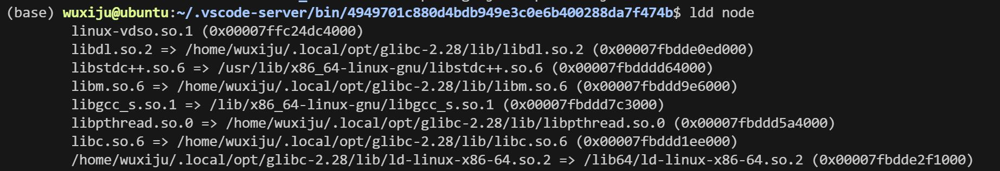
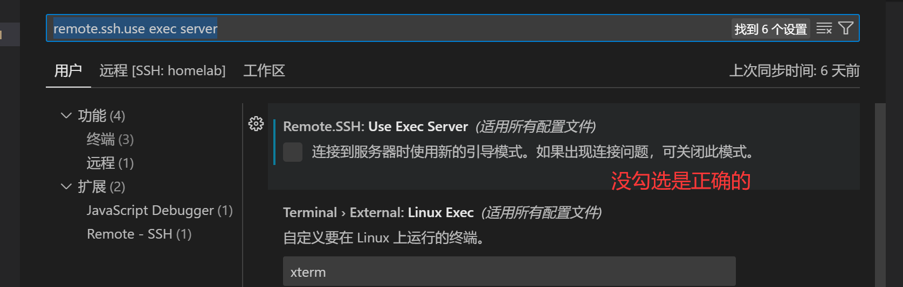

# 脚本工具集

本仓库包含了一系列用于环境配置的脚本，可帮助您快速设置开发环境。

`我fork了这个仓库，针对没有sudo权限的同志们进行了脚本修改，并完善了部分缺失的步骤`

`经我测试，在同步了vscode的设置后，cursor也可以直连服务器，可以使用cursor pro的agent模式（强烈推荐配置mcp工具），又是恐怖的生产力提升（过于好用）`

`推荐在服务器上安装各类主要插件，提升使用体验`

`要注意的是，在连接服务器的时候，注意.ssh文件的配置。笔者是macOS使用者，需要把组里发给你的ssh文件改名为.ssh，最后用命令合并到系统本身就有的.ssh文件中。一定注意不要直接替换！！！合并即可！！！`


## 如何将远程服务器的.ssh文件合并到系统.ssh文件中

将远程服务器上的`.ssh`文件合并到您本地系统的`.ssh`目录中，主要是为了集中管理您的SSH密钥和配置，以便更方便地连接到不同的远程服务器。这个过程涉及将密钥对和配置设置传输到您本地的中心位置。

### 理解 `.ssh` 目录

您的用户主目录 (`~/.ssh/`) 中的 `.ssh` 目录是 OpenSSH 存储所有用户特定配置文件和认证密钥的地方。它对于使用 SSH 进行安全远程连接至关重要。此目录中的主要文件通常包括：

  * `id_rsa` 或 `id_ed25519`（以及其他类似的 `id_*` 文件）：您的**私钥**。**这些密钥应始终保持私密和安全。**
  * `id_rsa.pub` 或 `id_ed25519.pub`（以及其他类似的 `id_*.pub` 文件）：您的**公钥**，您将其放置在远程服务器上进行身份验证。
  * `known_hosts`：存储您已连接的 SSH 服务器的主机密钥，用于验证服务器的身份。
  * `config`：一个可选但强烈推荐的文件，用于为不同的主机定义自定义 SSH 连接设置。

### 合并过程

假设您有一个来自其他来源（例如，备份、不同的用户或特定的项目）的 `.ssh` 目录，您希望将其集成到您本地的 `.ssh` 目录中。

-----

### 1\. 备份您现有的 `.ssh` 目录（至关重要！）

在进行任何更改之前，**务必备份您当前的 `~/.ssh` 目录**。这可以确保如果出现任何问题，您可以恢复到正常工作状态。

```bash
cp -r ~/.ssh/ ~/.ssh_backup_$(date +%Y%m%d%H%M%S)
```

-----

### 2\. 确定要合并的文件

检查您要合并的 `.ssh` 目录的内容。您主要会寻找：

  * **私钥和公钥对：** 诸如 `id_rsa`、`id_rsa.pub`、`id_ed25519`、`id_ed25519.pub` 等文件。
  * **`config` 文件：** 如果存在，此文件包含特定于主机的配置。
  * **`known_hosts` 文件：** 尽管不常见，但您可能希望从中添加新条目。

-----

### 3\. 复制密钥对

将私钥和公钥对从源 `.ssh` 目录复制到您系统的 `~/.ssh/` 目录。

假设您的源 `.ssh` 目录位于 `/path/to/您的/其他/.ssh/`。

```bash
cp /path/to/您的/其他/.ssh/id_rsa ~/.ssh/
cp /path/to/您的/其他/.ssh/id_rsa.pub ~/.ssh/
# 如果有其他密钥对，请重复此操作，例如 id_ed25519 等。
```

**重要：权限！** 复制后，请确保私钥文件具有正确且严格的权限（只允许所有者读/写）。公钥文件可以更宽松。

```bash
chmod 600 ~/.ssh/id_rsa # 或任何其他私钥文件
chmod 644 ~/.ssh/id_rsa.pub # 或任何其他公钥文件
```

-----

### 4\. 合并 `config` 文件

如果您的源 `.ssh` 目录中包含一个 `config` 文件，并且您本地也有一个 `config` 文件，您需要将它们的内容合并。**不要直接覆盖您本地的 `config` 文件，除非您确定它不包含任何重要配置。**

**推荐方法：手动合并或追加**

1.  **查看源 `config` 文件：**
    ```bash
    cat /path/to/您的/其他/.ssh/config
    ```
2.  **将其内容追加到您本地的 `config` 文件中：**
    ```bash
    cat /path/to/您的/其他/.ssh/config >> ~/.ssh/config
    ```
    **注意：** 如果有重复的主机或冲突的设置，您需要手动编辑 `~/.ssh/config` 文件来解决它们。通常，您会为不同的主机定义独立的 `Host` 块。

-----

### 5\. 合并 `known_hosts` 文件（可选）

如果源 `known_hosts` 文件包含您想要信任的新服务器指纹，您可以将其内容追加到您本地的 `known_hosts` 文件中。

```bash
cat /path/to/您的/其他/.ssh/known_hosts >> ~/.ssh/known_hosts
```

**注意：** 如果有重复或冲突的主机密钥，SSH 会在连接时提示您。

-----

### 6\. 验证和测试

合并完成后，通过尝试连接到您期望使用新合并密钥和配置的远程服务器来测试您的 SSH 连接。

```bash
ssh <您的远程服务器用户名>@<您的远程服务器IP或主机名>
```

如果连接成功，则表示合并过程顺利。

-----

### 常见问题与提示

  * **权限问题：** SSH 对 `.ssh` 目录及其内容的权限非常敏感。如果权限不正确，SSH 会拒绝使用密钥。确保 `~/.ssh` 目录的权限为 `700`，私钥文件的权限为 `600`。
    ```bash
    chmod 700 ~/.ssh/
    chmod 600 ~/.ssh/id_rsa # 适用于您的私钥文件
    ```
  * **重复的密钥：** 避免在 `~/.ssh` 目录中拥有多个具有相同功能的私钥（例如，两个不同的 `id_rsa`）。如果需要使用不同的密钥连接到不同的服务器，请在 `config` 文件中明确指定每个主机的 `IdentityFile`。
  * **`config` 文件的重要性：** 善用 `config` 文件可以极大地简化您的 SSH 工作流程。您可以为每个主机定义别名、用户名、端口、使用的密钥文件等。

通过遵循这些步骤，您可以有效地将外部 `.ssh` 文件中的配置和密钥安全地合并到您的本地系统，从而实现更便捷的远程服务器管理。

## 脚本文件从这里开始
## setup_anaconda.sh

### 功能介绍
这个脚本用于在Linux环境中自动安装Anaconda3，特别适用于怀柔节点服务器。脚本会：
- 自动下载最新版本的Anaconda（Linux 64位）
- 在$HOME目录下安装Anaconda3
- 配置必要的环境变量
- 初始化conda环境
- 提供选项处理SSL证书验证问题
- 这是由CarterYin（笔者）修改的版本，针对没有sudo权限（无法新建原来脚本中的data1文件夹等）的同志。

### 使用方法
登录到怀柔节点，然后直接执行仓库根目录下的setup_anaconda.sh
```bash
wget --no-check-certificate -O - https://raw.githubusercontent.com/CarterYin/scripts/refs/heads/master/setup_anaconda.sh | bash
```

## setup_ollama.sh

### 功能介绍
这个脚本用于设置和配置Ollama（大型语言模型运行环境）。脚本会：
- 下载Ollama的Linux x64版本
- 解压并安装到/data1/username/ollama目录
- 配置必要的环境变量（OLLAMA_HOST, OLLAMA_MODELS等）
- 使用tmux创建一个后台会话并启动Ollama服务器
- 设置Ollama运行环境，使其准备好运行模型（如qwen:0.5b）

### 使用方法
直接执行仓库根目录下的setup_ollama.sh
```bash
wget --no-check-certificate -O - https://raw.githubusercontent.com/ziwenhahaha/scripts/refs/heads/master/setup_ollama.sh | bash
```

## setup_vscode_patch.sh

### 功能介绍
这个脚本解决了在某些旧Linux系统上运行VS Code远程开发时的glibc版本兼容性问题。脚本会：
- 创建必要的跳过服务器要求检查的文件
- 安装bison（通过conda）
- 下载和编译glibc 2.28
- 创建一个自动修补VS Code服务器二进制文件的脚本，让它使用自定义的glibc库
- 设置SSH会话，在每次连接时自动应用补丁
- 避免VS Code远程连接时因glibc版本不匹配而出现的错误

### 使用方法
1、先使用setup_anaconda.sh脚本去安装一个anaconda，跟着提示去运行，它会自动地在/data1/username目录下安装一个anaconda。如果已经安装anaconda了的话，跳过这一步骤。
```bash 
看本文档的setup_anaconda.sh
```

2、执行setup_vscode_patch.sh脚本
原来作者的脚本在我(CarterYin)运行的时候，出现了无法创建脚本文件等问题，这里给出一个解决方案，运行以下命令：
```bash
mkdir -p ~/.ssh
chmod 700 ~/.ssh
```

- mkdir -p ~/.ssh：如果 ~/.ssh 目录不存在，此命令会创建它。-p 选项确保即使父目录（这里指 ~，您的主目录）不存在，也会一并创建（不过通常主目录是存在的）。

- chmod 700 ~/.ssh：设置 .ssh 目录的权限为 700。这意味着只有您的用户 (yinchao) 拥有对该目录的完全权限（读、写、执行），其他任何用户都没有权限访问。

```bash 
wget --no-check-certificate -O - https://raw.githubusercontent.com/ziwenhahaha/scripts/refs/heads/master/setup_vscode_patch.sh | bash
```
安装完毕后，打补丁脚本不会自动触发，需要通过连接ssh的时候来触发这个打补丁。所以第四步需要重启vscode两次。

检测打补丁成功，可以使用：`cd ~/.vscode-server/bin/commit-id/ ldd node`  指令来查看，commit-id需要自己去查看，不能直接复制粘贴本命令。

commit-id 的查看命令是：`ls -l ~/.vscode-server/bin/`

你将会看到类似下面的输出：

`total 4`

`drwxrwx--- 6 yinchao yinchao 4096 Jul 22 08:05 441438abd1ac652551dbe4d408dfcec8a499b8bf`

若如下方显示，则为打补丁成功，（因为现在尚未触发，所以会提示2.27版本不匹配的问题）：


3、客户端需要设置一个东西：在设置里面把remote.ssh.use exec server 的勾去掉：


4、重启vscode两次，第一次是为了打补丁，第二次是正常进入

### 注意事项
- setup_vscode_patch.sh依赖于先安装anaconda
